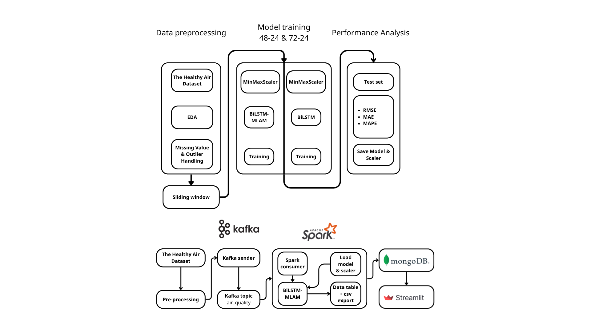

# Air Quality Forecasting using BiLSTM-MLAM

> **Note:** This README was generated with the assistance of AI based on the project source code and project report, then reviewed and edited by the author.

A Big Data course project for forecasting **PM2.5 concentration** in Ho Chi Minh City using the **BiLSTM-MLAM** deep learning model. The project also provides a real-time prediction pipeline built with **Apache Kafka**, **Apache Spark Streaming**, **MongoDB**, and **Streamlit**.

---

## Pipeline

<p align="center">
  
</p>

---

## Dataset

[The HelthyAir Dataset: Outdoor Air Quality in Ho Chi Minh City, Vietnam](https://data.mendeley.com/datasets/pk6tzrjks8/1)
## Project Structure

```text
DoAn/
├── Data/                     # Dataset and sliding-window data
├── images/                   # EDA figures and pipeline images
├── models/                   # Trained models
├── streaming/                # Real-time prediction system
│   ├── data/
│   │   ├──data.ipynb                     # Create data simulation_stream.csv for streaming
│   │   ├──latest_predictions.json        # Lasted prediction from streaming
│   │   ├──simulation_stream.csv          # Sample data for streaming
│   │   ├──streaming_history.csv          # Lasted streaming history
│   ├── models/                           # Models and ít's scaler
│   ├── producer.py           
│   ├── spark_consumer.py           # Consumer without mongodb
│   ├── spark_consumer_mongodb.py   # Consumer with mongodb
│   ├── app_dashboard.py            # App without mongodb
│   └── app_dashboard_mongodb.py    # App with mongodb

└── README.md
```

---

## Installation

### Clone repository

```bash
git clone <repository-url>
cd DoAn
```


### Run Streaming Pipeline

Start Kafka and MongoDB, then run:

```bash
python producer.py
```

```bash
python spark_consumer.py
```

Finally, launch the dashboard:

```bash
streamlit run app_dashboard.py
```

---

## Results

- Forecast PM2.5 concentration for **6 monitoring stations** in Ho Chi Minh City.
- Compare **BiLSTM** and **BiLSTM-MLAM** using **48→24** and **72→24** sliding-window settings.
- Evaluate model performance with:
  - RMSE
  - MAE
  - MAPE
- Support **real-time prediction** through Kafka + Spark Streaming with visualization on Streamlit.
